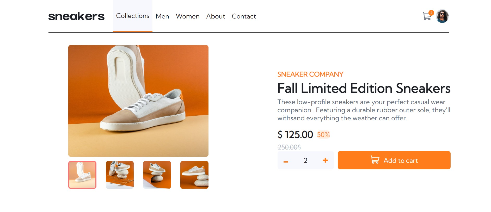
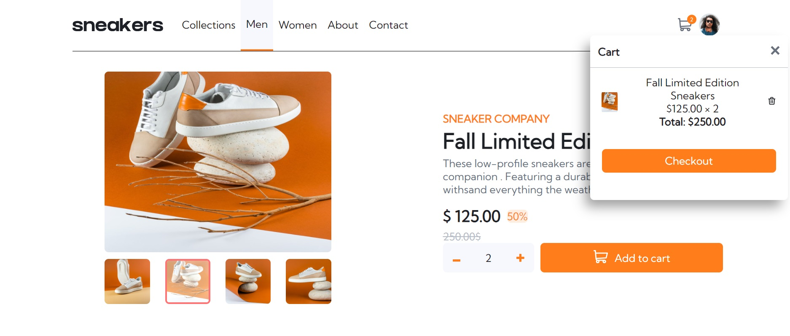
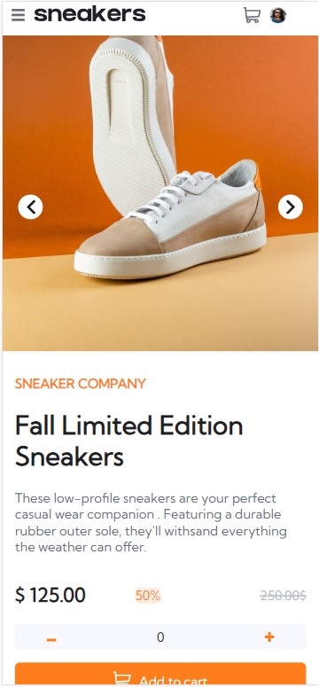
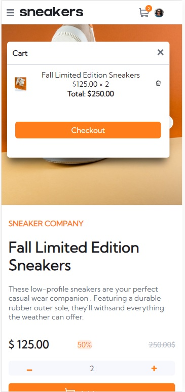

# Newsletter sign-up form with success message

Ecomerce-website-main-page 

## Table of contents

- [Overview](#overview)
  - [The challenge](#the-challenge)
  - [Screenshot](#screenshot)
- [My process](#my-process)
  - [Built with](#built-with)
  - [Usage](#usage)
- [Author](#author)
- [Project](#project)

## Overview

### The challenge
Ecomerce-website-main-page is a is frontend mentor challenge for intermidiate level 
this website page allows you to enter a certain quantity for a sneakers 'product'.
and add it to a cart that print the unit price and the quantity added and the total price.
you can also delete the product that you have putted in the cart. 
also it has a resposive disgn and it's open source

### Screenshots


*Home Page of App.*

*Desktop view of the Home Page  after adding certain quantity of the product to the cart with the appearence of the cart .*

*Home Page mobile view of App.*

*Mobile view of the Home Page after adding certain quantity of the product to the cart.*

*A desktop view for the cart after deleteing it's content .*

## My process

### Built with

- Vue js
- CSS custom properties
- Flexbox
- CSS Grid
- Mobile-first workflow
- [vuejs](https://vuejs.org/) - JS library

### Usage

1. Clone the repository.
2. Open the repository. 
3. setup the project (npm install)
4. compile the project(npm run serve) 
4. Explore the awesome features!


## Author

Yassine Mehia

## project

### Project setup
```
npm install
```

### Compiles and hot-reloads for development
```
npm run serve
```

### Compiles and minifies for production
```
npm run build
```